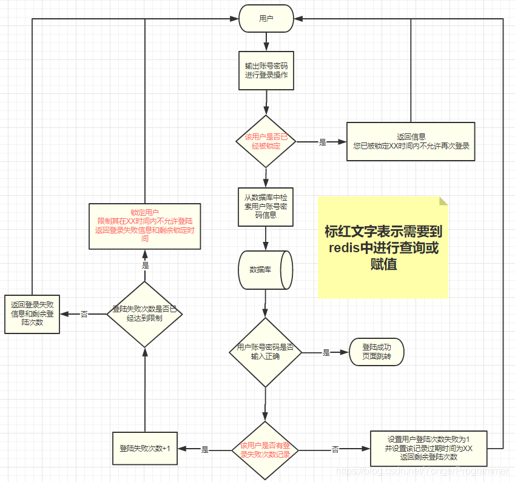

# 优化的安全登录系统

## 获取发起访问的位置

> [获取更多查看访问ip详细信息的api接口](https://blog.csdn.net/qq_36171783/article/details/114537229)

## 限制登录错误次数

### 参考图

### 思路

- 获取访问ip登录

- 先查Redis是否登录失败过

- 登录失败的记录是否超过上限

- 再查数据库是否被冻结账号

- 绑定ip增加一次登录失败的记录到Redis

- ip失败次数超过三次直接返回
